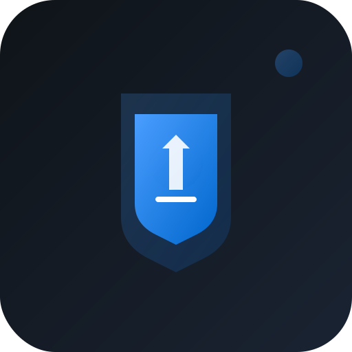

# ResetPath - Break Free 🚀

A private, offline-first iOS app designed to help break free from porn addiction using evidence-based psychology. Built with React and wrapped as a native iOS app using Capacitor for easy sideloading through Xcode.



## ✨ Features

### 🎯 Core Functionality
- **Streak Tracking** - Monitor your progress with visual streak counters
- **Panic Button** - Quick access to urge management tools when you need them most
- **Urge Management** - Breathing exercises, grounding techniques, and distraction activities
- **Private Journaling** - Reflect on your journey with guided prompts and gratitude exercises
- **Progress Visualization** - Charts and timelines to see your improvement over time
- **Daily Goals** - Set and complete daily recovery goals with satisfying feedback

### 🔒 Privacy & Security
- **100% Offline** - All data stays on your device, no external servers
- **No Tracking** - Zero analytics, telemetry, or user tracking
- **Local Storage** - Uses browser localStorage for data persistence
- **No Accounts** - No sign-ups, logins, or personal information required

### 📱 iOS Optimized
- **Native iOS App** - Runs as a real iOS app via Capacitor
- **Safe Area Support** - Proper handling of iPhone X+ notches and home indicators
- **iOS Gestures** - Native swipe and touch interactions
- **Dark Theme** - Modern masculine design that respects iOS dark mode
- **One-Hand Friendly** - Bottom navigation optimized for single-hand use

### 🎨 User Experience
- **Onboarding Flow** - Welcome slideshow explaining features and science
- **Motivational Content** - Daily recovery facts based on actual recovery timelines
- **Satisfying Feedback** - Engaging animations and haptic feedback
- **Minimalist Design** - Clean, distraction-free interface focused on recovery

## 🚀 Quick Start

### For Users (Sideloading)
1. Clone this repository
2. Follow the [Xcode Sideloading Guide](XCODE_SIDELOADING.md)
3. Install on your iPhone and start your recovery journey!

### For Developers
```bash
# Clone the repository
git clone https://github.com/yourusername/resetpath.git
cd resetpath

# Install dependencies
npm install

# Start development server
npm start

# Build for production
npm run build

# Open in Xcode for iOS development
npx cap open ios
```

## 📋 Requirements

### For Sideloading
- macOS with Xcode installed
- iOS device (iPhone/iPad)
- Apple Developer account (free account works)
- USB cable for device connection

### For Development
- Node.js 16+ and npm
- React development environment
- Capacitor CLI

## 🛠 Tech Stack

- **Frontend**: React 18 with TypeScript
- **Routing**: React Router v6
- **Mobile Wrapper**: Capacitor 5
- **Styling**: CSS3 with iOS-specific optimizations
- **Icons**: Custom SVG icons with masculine theme
- **Data Storage**: Browser localStorage (offline-first)

## 📁 Project Structure

```
ResetPath/
├── src/                    # React source code
│   ├── components/         # Reusable UI components
│   ├── screens/           # Main app screens
│   ├── App.tsx            # Main app component
│   └── ios.css            # iOS-specific styles
├── public/                # Static assets
│   ├── icons/             # App icons (multiple sizes)
│   ├── splash/            # iOS splash screens
│   └── manifest.json      # PWA manifest
├── ios/                   # Native iOS project (Capacitor)
│   └── App/
│       └── App.xcworkspace # Open this in Xcode
├── build/                 # Production build output
├── capacitor.config.ts    # Capacitor configuration
└── package.json          # Dependencies and scripts
```

## 📖 Documentation

- **[Xcode Sideloading Guide](XCODE_SIDELOADING.md)** - Complete instructions for installing on iPhone
- **[AltStore Deployment](ALTSTORE_DEPLOYMENT.md)** - PWA and AltStore distribution guide

## 🎯 Recovery Features Explained

### Streak Tracking
- Visual counter showing current streak days
- Longest streak achievement tracking
- Motivational milestones and celebrations

### Urge Management Tools
- **Breathing Exercises** - Guided breathing to manage urges
- **Grounding Techniques** - 5-4-3-2-1 sensory grounding
- **Distraction Activities** - Healthy alternatives when urges hit
- **Emergency Contacts** - Quick access to support (optional)

### Progress Visualization
- Timeline view of your recovery journey
- Relapse tracking with learning opportunities
- Weekly and monthly progress summaries

### Private Journaling
- Daily reflection prompts
- Gratitude practice integration
- Trigger identification and analysis
- Completely private - never leaves your device

## 🔧 Development

### Available Scripts
- `npm start` - Start development server
- `npm run build` - Build for production
- `npm run build:pwa` - Build PWA with icons
- `npm run generate-icons` - Generate app icons
- `npx cap sync ios` - Sync web assets to iOS
- `npx cap open ios` - Open in Xcode

### Making Changes
1. Edit React code in `src/`
2. Test in browser with `npm start`
3. Build with `npm run build`
4. Sync to iOS with `npx cap sync ios`
5. Test in Xcode iOS Simulator or device

## 🤝 Contributing

This is a personal recovery tool, but contributions are welcome:

1. Fork the repository
2. Create a feature branch
3. Make your changes
4. Test thoroughly (this affects people's recovery!)
5. Submit a pull request

### Guidelines
- Maintain privacy-first approach
- Keep UI simple and distraction-free
- Follow iOS design guidelines
- Ensure offline functionality
- Test on actual iOS devices

## 📄 License

This project is open source and available under the [MIT License](LICENSE).

## ⚠️ Disclaimer

ResetPath is a self-help tool and is not a substitute for professional medical or psychological treatment. If you're struggling with addiction, please consider seeking help from qualified healthcare professionals.

## 🙏 Acknowledgments

- Built with evidence-based recovery principles
- Inspired by the NoFap and recovery communities
- Designed with privacy and dignity in mind
- Created to help people reclaim their lives

---

**Start your recovery journey today. You've got this! 💪**

## 📞 Support

If you encounter issues with sideloading or the app:
1. Check the [Xcode Sideloading Guide](XCODE_SIDELOADING.md)
2. Ensure your iOS device is properly connected and trusted
3. Verify you have the latest version of Xcode
4. Try cleaning and rebuilding the project

Remember: Your recovery matters, and your privacy is protected. All data stays on your device, always.
